# inovamed-
Plataforma para conectar pacientes, medicos e ensaios clinicos
## Fluxograma

### Fluxo 1
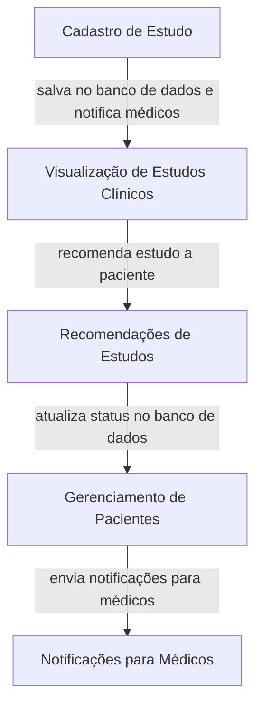
### Fluxo 2
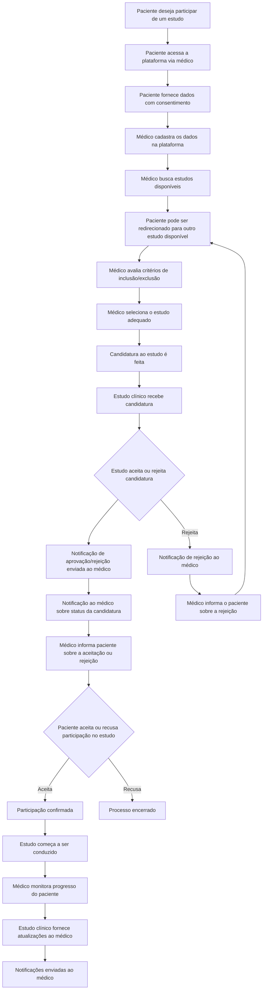
## Diagrama de implantação 
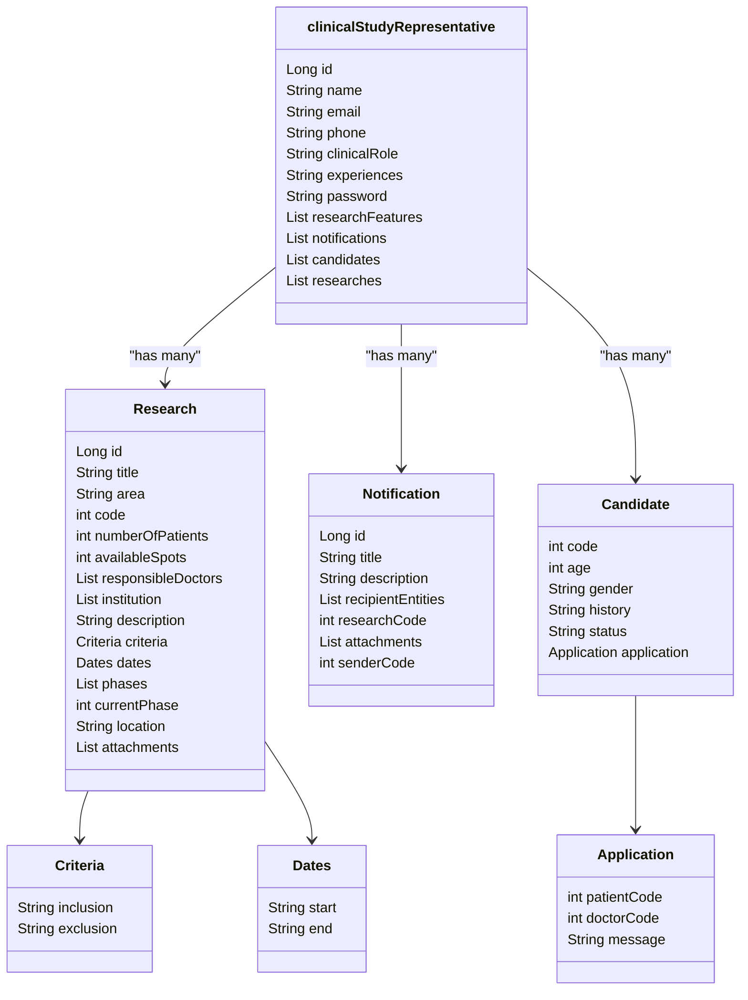
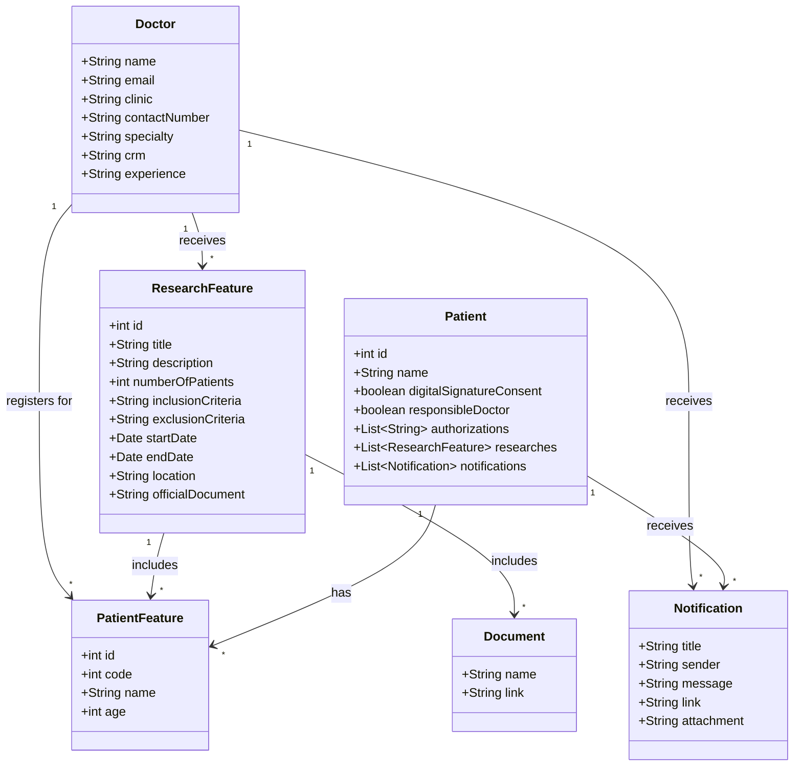

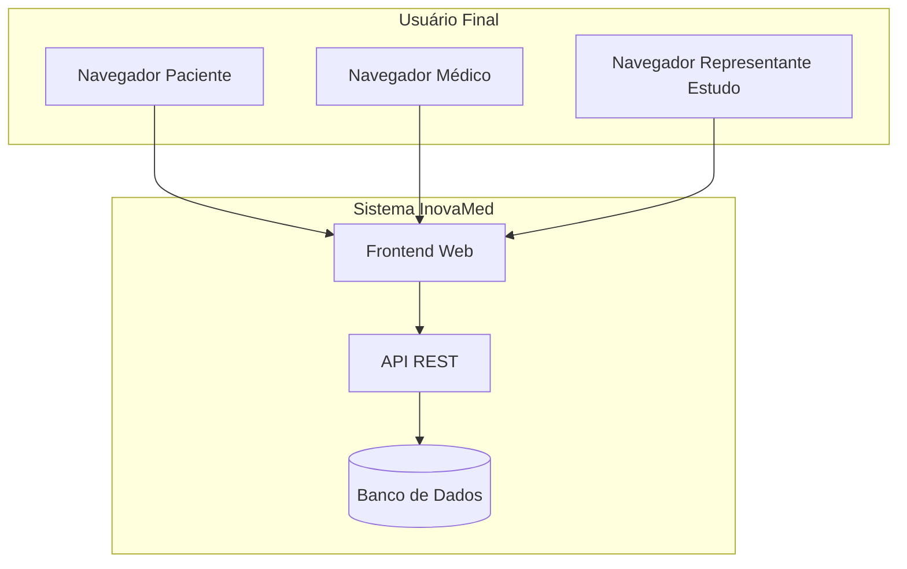
## Diagrama ER
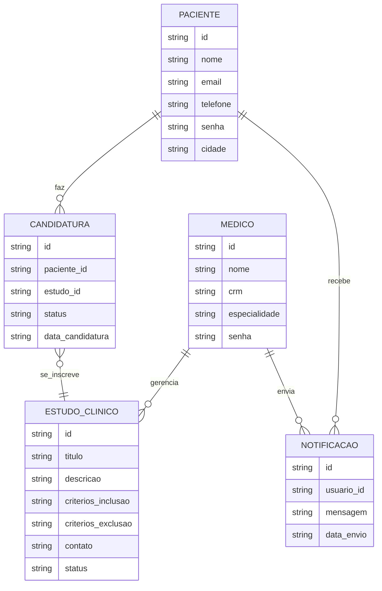
## Diagrama UML
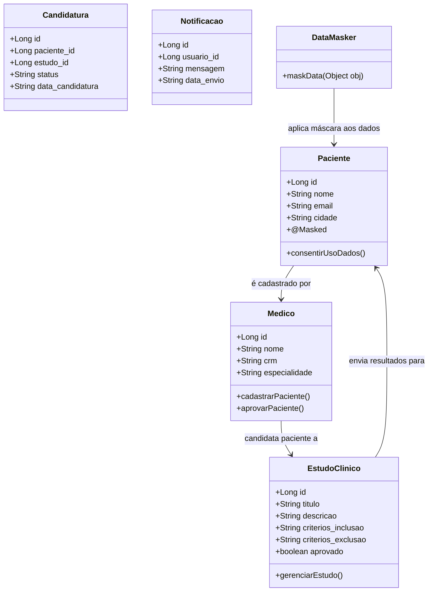
## Fluxo de telas
### Tela login
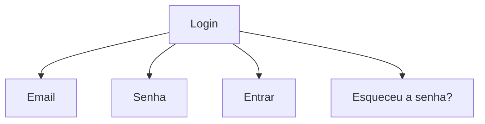
### Tela de Cadastro de Paciente
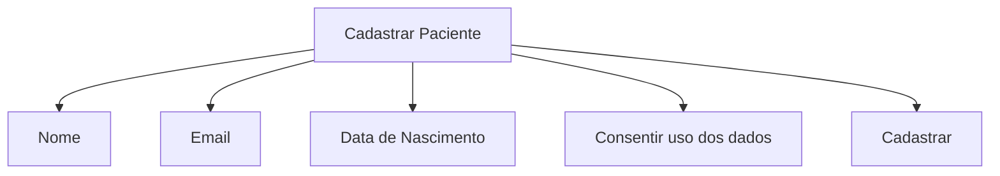
### Painel do Médico
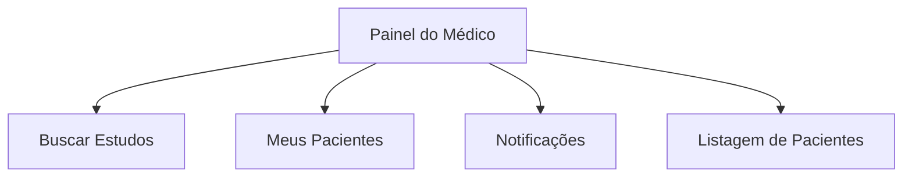
### Tela de Busca de Estudos Clínicos
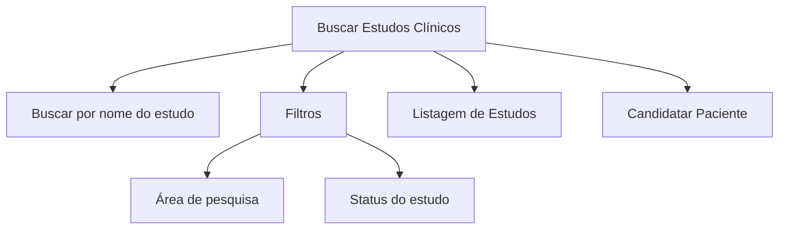
### Tela de Detalhes do Estudo
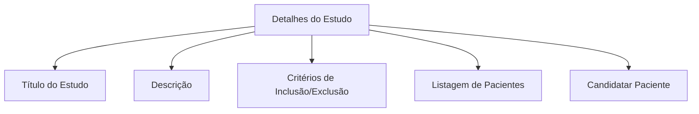
### Tela de Notificações
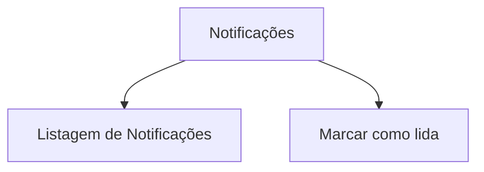
### Tela de Gerenciamento de Estudos (para Representante de Estudos)
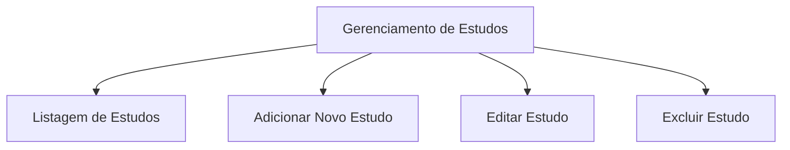
### Tela de Configurações de Conta
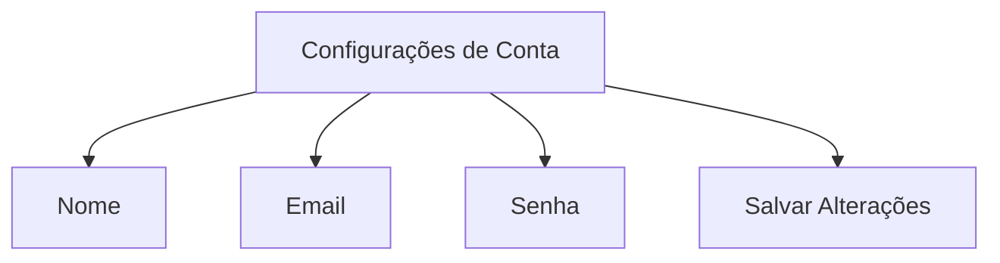

