# inovamed-
Plataforma para conectar pacientes, medicos e ensaios clinicos
## Fluxograma

### Fluxo 1
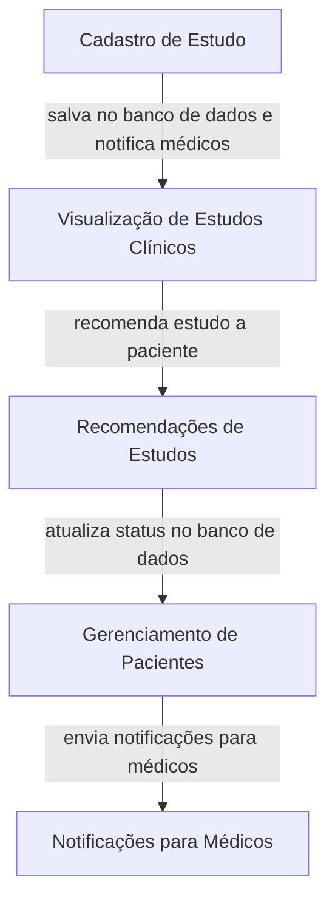
### Fluxo 2
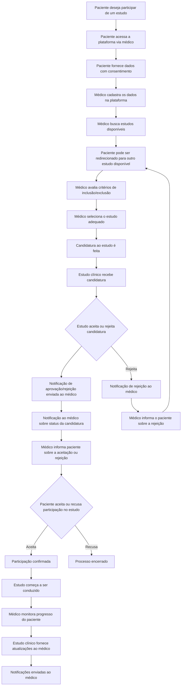
## Diagrama de implantação 
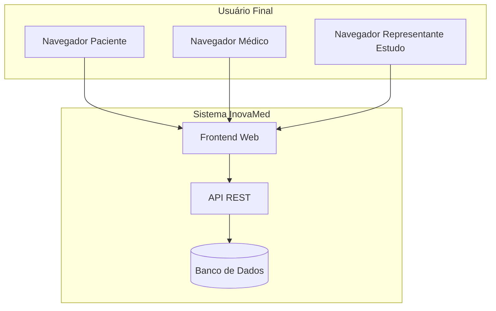
## Diagrama ER
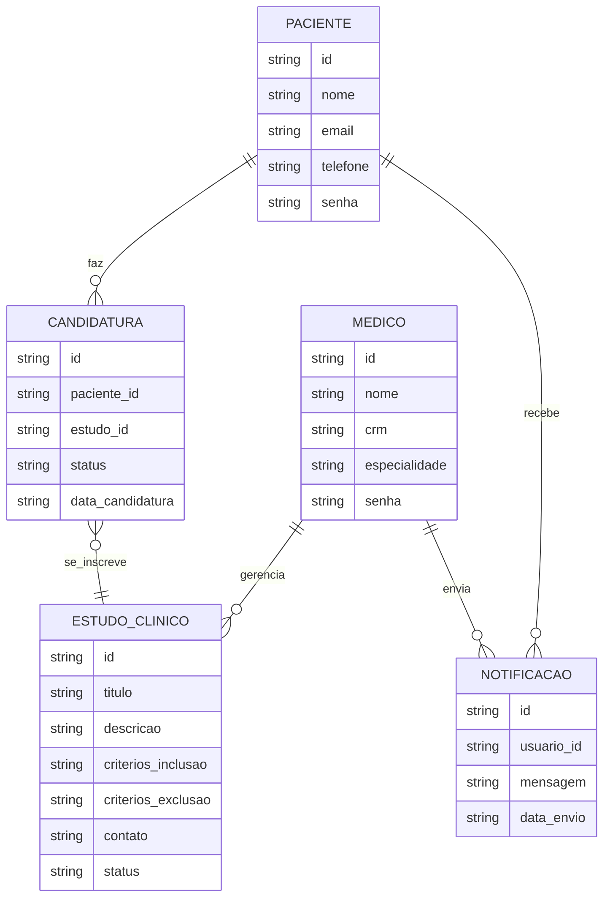
## Diagrama UML
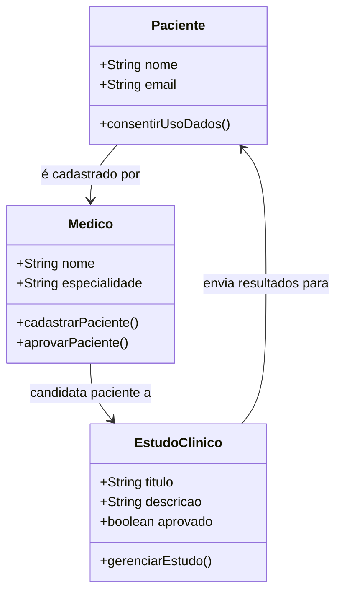
## Fluxo de telas
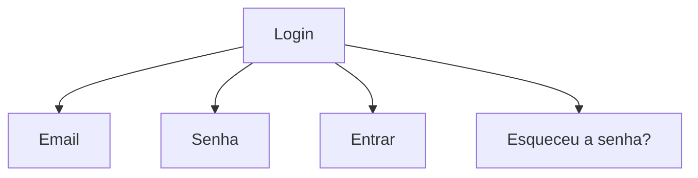
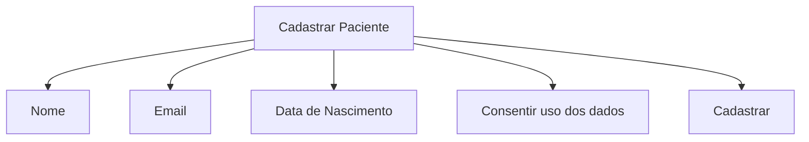
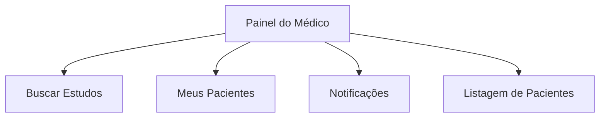
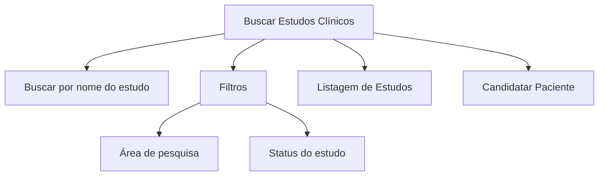
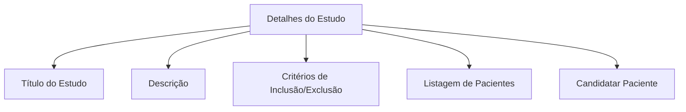
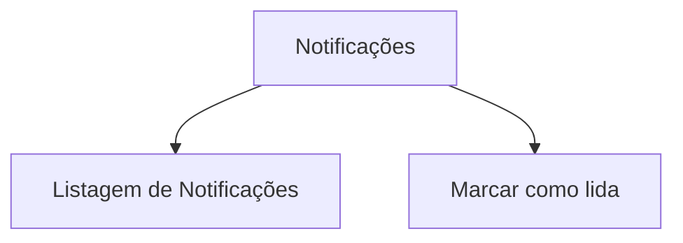
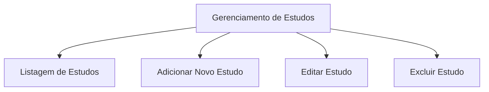
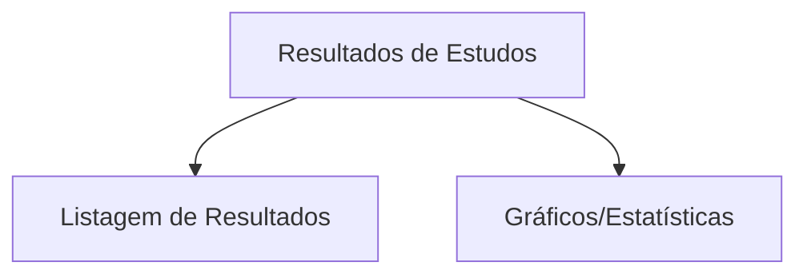
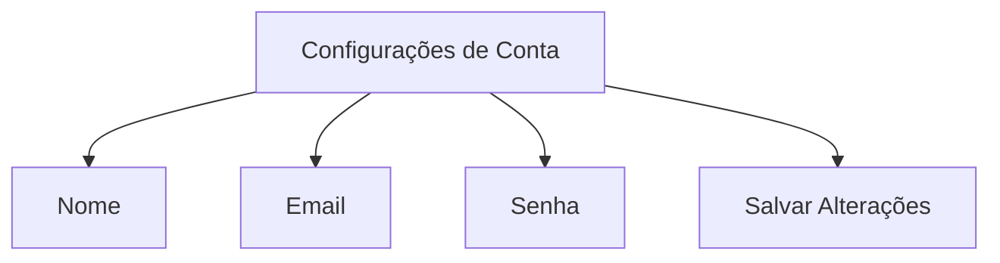
