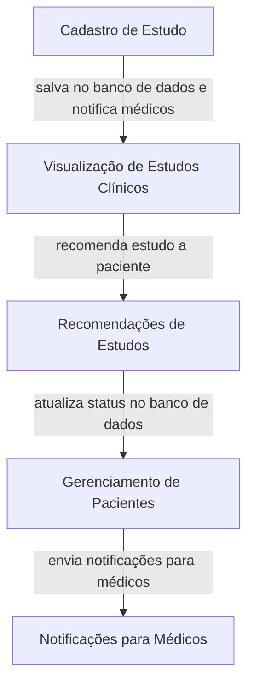

# inovamed-
Plataforma para conectar pacientes, medicos e ensaios clinicos
## Fluxograma

```mermaid
graph TD;
    A[Cadastro de Estudo] -->|salva no banco de dados e notifica médicos| B[Visualização de Estudos Clínicos];
    B -->|recomenda estudo a paciente| C[Recomendações de Estudos];
    C -->|atualiza status no banco de dados| D[Gerenciamento de Pacientes];
    D -->|envia notificações para médicos| E[Notificações para Médicos];
```
