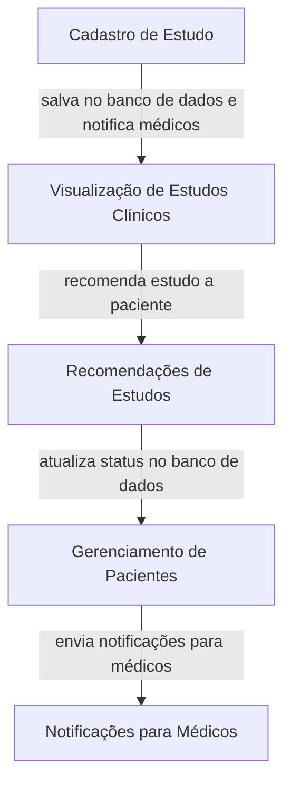
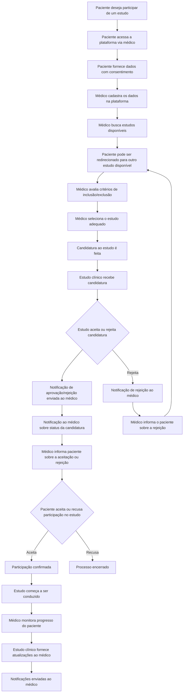
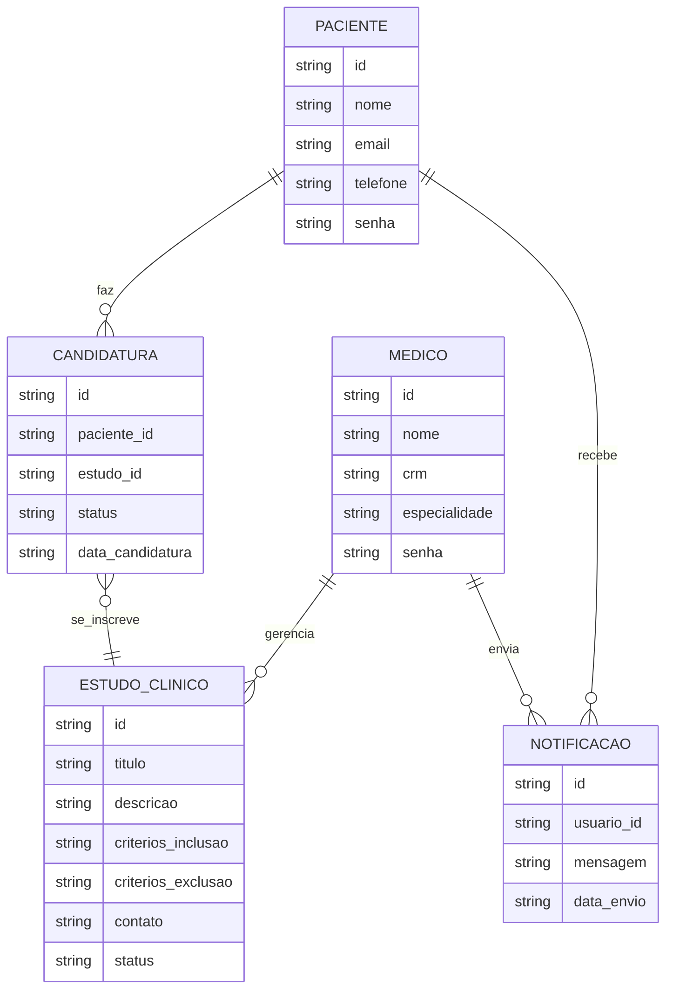

# inovamed-
Plataforma para conectar pacientes, medicos e ensaios clinicos
## Fluxograma

## Diagrama Caso do uso
@startuml
actor Paciente
actor Medico
actor RepresentanteEstudo
actor SistemaInovaMed as Sistema

usecase UC1 as "Consentir com uso dos dados"
usecase UC2 as "Cadastrar dados do paciente"
usecase UC3 as "Buscar estudos clínicos"
usecase UC4 as "Candidatar paciente a estudo"
usecase UC5 as "Receber notificações do estudo"
usecase UC6 as "Aprovar/rejeitar paciente"
usecase UC7 as "Gerenciar estudos"
usecase UC8 as "Visualizar resultados do estudo"

Paciente --> UC1
Medico --> UC2
Medico --> UC3
Medico --> UC4
Medico --> UC5
RepresentanteEstudo --> UC6
RepresentanteEstudo --> UC7
Medico --> UC8

Sistema --> UC1
Sistema --> UC2
Sistema --> UC3
Sistema --> UC4
Sistema --> UC5
Sistema --> UC6
Sistema --> UC7
Sistema --> UC8
@enduml
## Diagrama ER

    
