# inovamed-
## Descrição
InovaMed é uma plataforma digital inovadora desenvolvida para conectar pacientes a estudos clínicos, com foco na área de pesquisa clínica em saúde. O sistema permite que médicos candidatem seus pacientes a estudos relevantes, garantindo a privacidade e a segurança dos dados. Com uma interface simples e eficiente, InovaMed facilita a comunicação entre médicos, pacientes e representantes de estudos clínicos, promovendo um processo ágil e transparente. O projeto visa acelerar a pesquisa e o desenvolvimento de novos tratamentos, contribuindo para o avanço da medicina.
## Tecnologias utilizadas
- **Java 17**: A linguagem de programação utilizada para desenvolver a lógica de backend da aplicação.
- **Spring Boot 3**: Framework para construção de aplicações Java, utilizado para criar a API RESTful do projeto.
- **PostgreSQL**: Sistema de gerenciamento de banco de dados relacional utilizado para armazenar as informações da aplicação.
- **React**: Biblioteca JavaScript utilizada para construir a interface do usuário (front-end), proporcionando uma experiência interativa e dinâmica.

## como instalar

1. **Clone o repositório**

   Abra seu terminal e execute o seguinte comando para clonar o repositório:

   ```bash
git clone https://github.com/seu-usuario/inovamed.git](https://github.com/andrefilipe1310/inovamed-.git
cd inovamed
 

## Fluxograma

### Fluxo 1
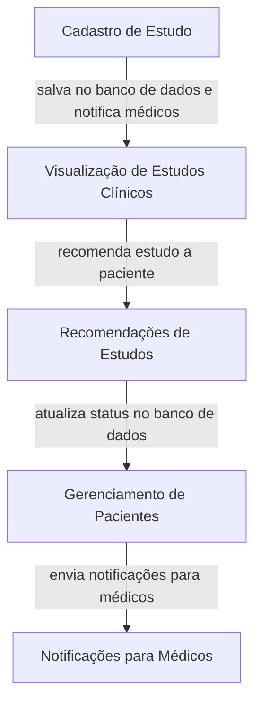
### Fluxo 2
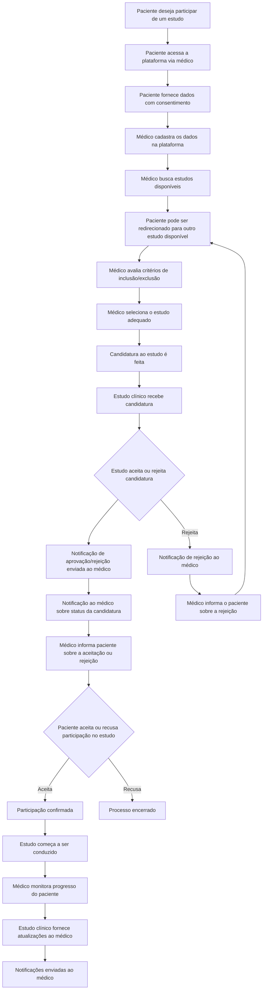
## Diagrama de implantação 

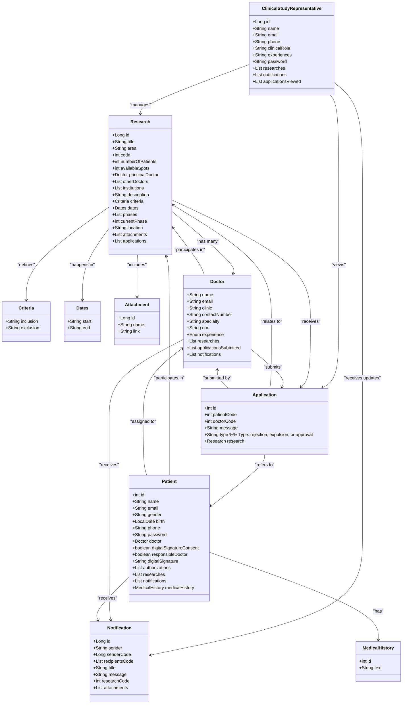


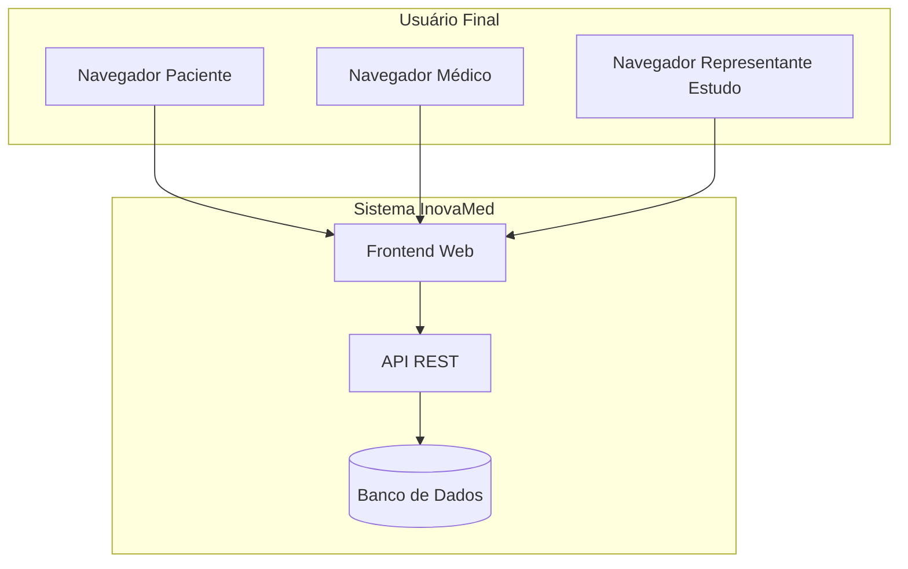
## Diagrama ER
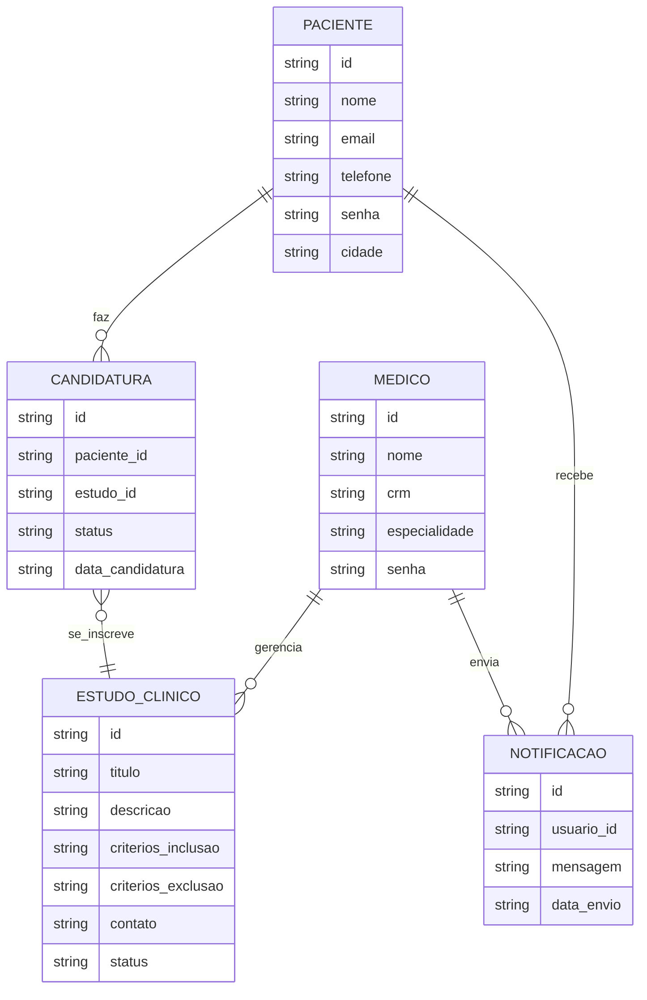
## Diagrama UML
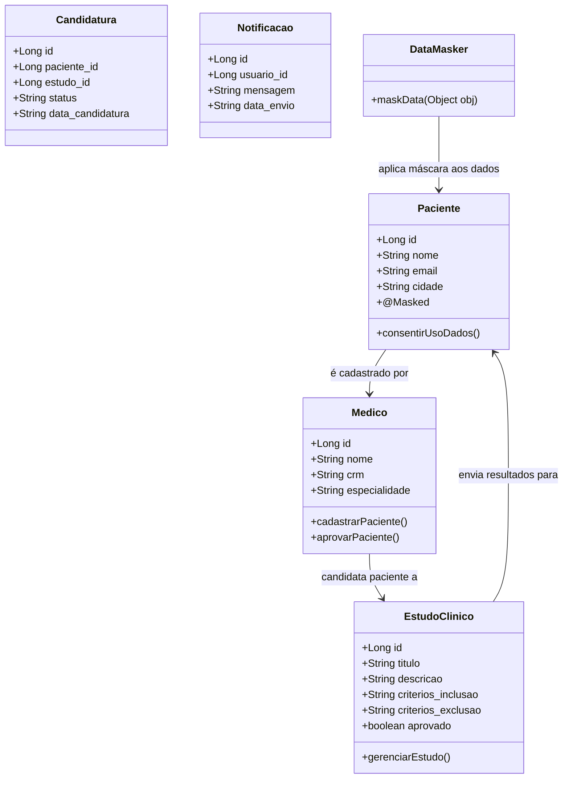
## Fluxo de telas
### Tela login
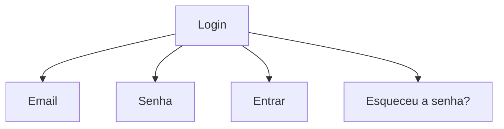
### Tela de Cadastro de Paciente
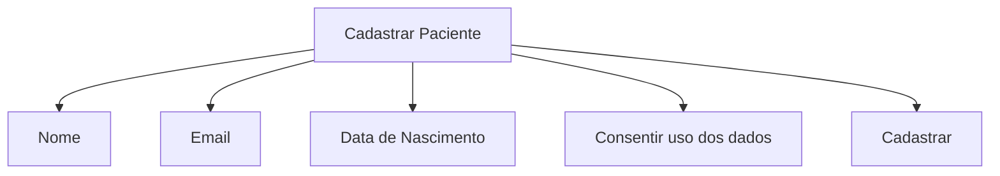
### Painel do Médico
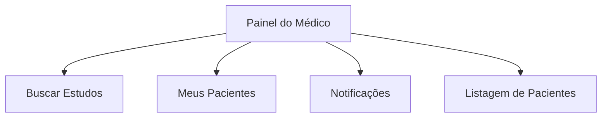
### Tela de Busca de Estudos Clínicos
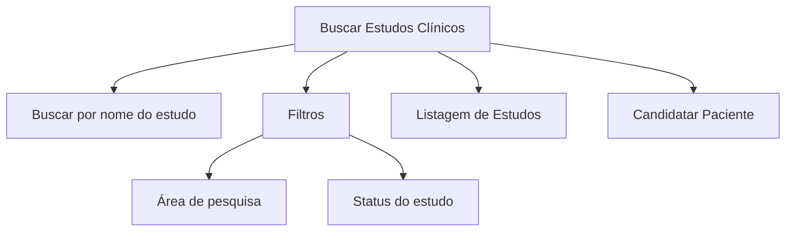
### Tela de Detalhes do Estudo
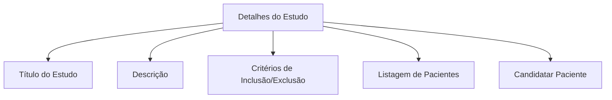
### Tela de Notificações
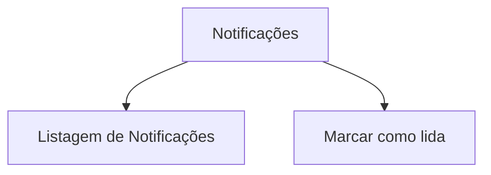
### Tela de Gerenciamento de Estudos (para Representante de Estudos)
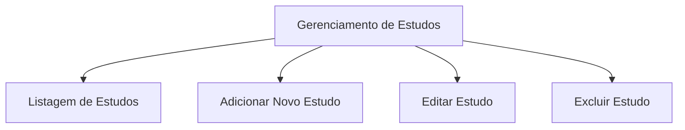
### Tela de Configurações de Conta
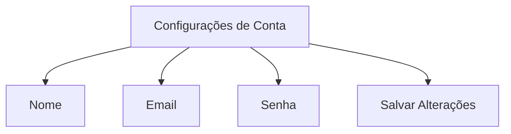

