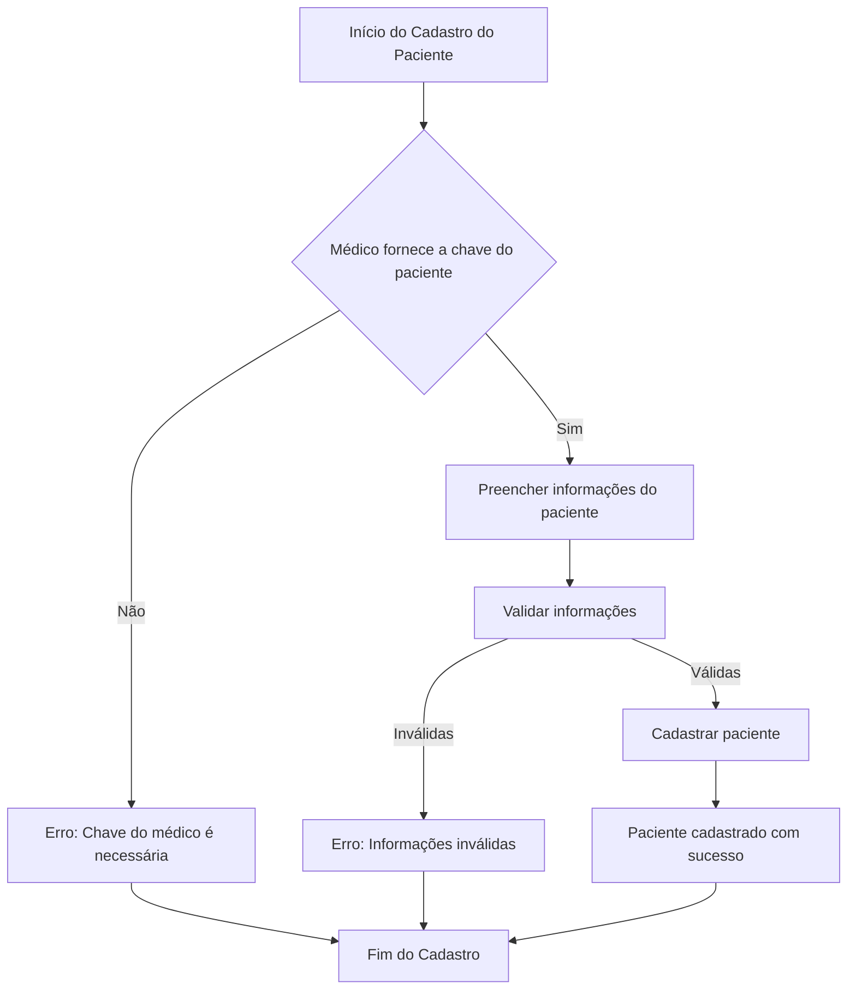
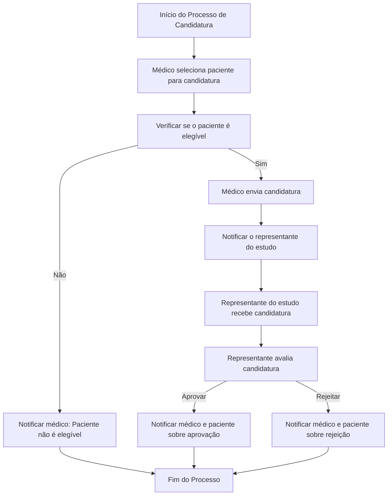
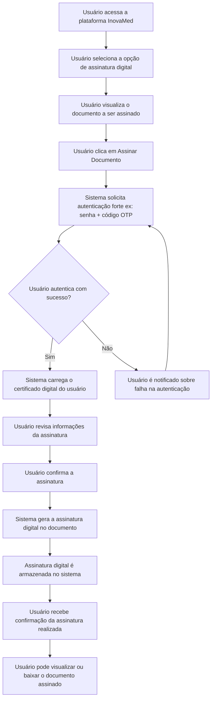
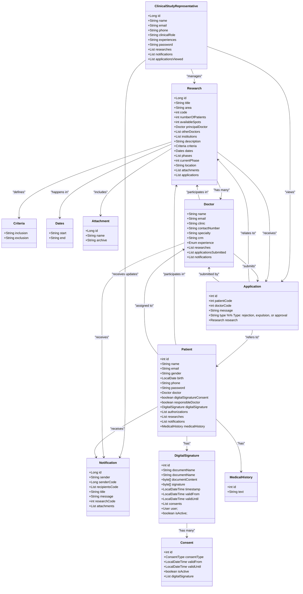
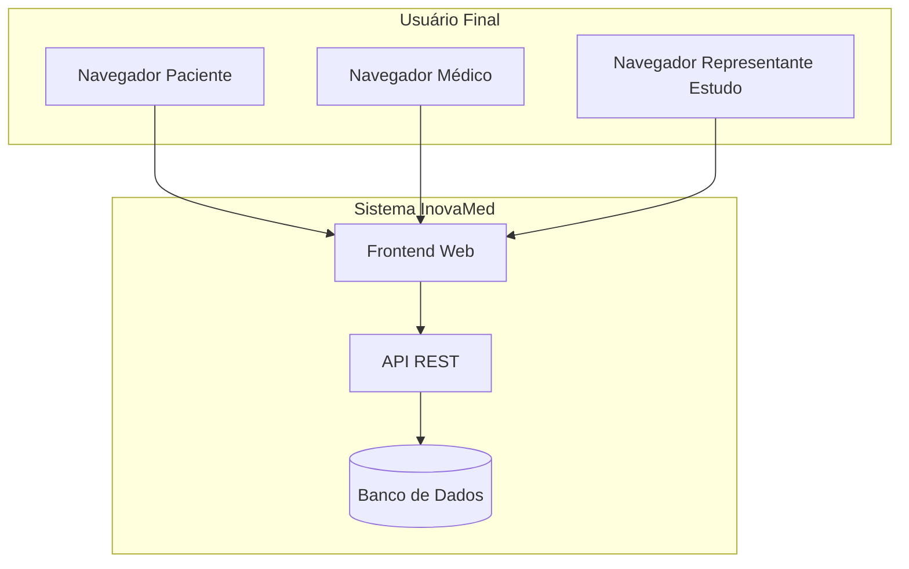
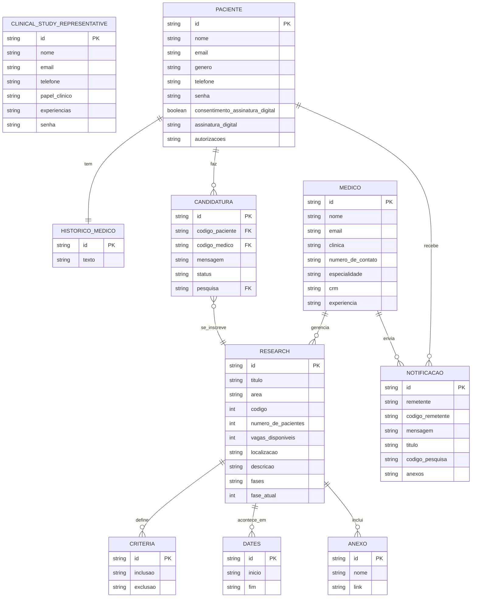

# Inovamed
## Descrição
InovaMed é uma plataforma digital inovadora desenvolvida para conectar pacientes a estudos clínicos, com foco na área de pesquisa clínica em saúde. O sistema permite que médicos candidatem seus pacientes a estudos relevantes, garantindo a privacidade e a segurança dos dados. Com uma interface simples e eficiente, InovaMed facilita a comunicação entre médicos, pacientes e representantes de estudos clínicos, promovendo um processo ágil e transparente. O projeto visa acelerar a pesquisa e o desenvolvimento de novos tratamentos, contribuindo para o avanço da medicina.
## Tecnologias utilizadas
- **Java 17**: A linguagem de programação utilizada para desenvolver a lógica de backend da aplicação.
- **Spring Boot 3**: Framework para construção de aplicações Java, utilizado para criar a API RESTful do projeto.
- **PostgreSQL**: Sistema de gerenciamento de banco de dados relacional utilizado para armazenar as informações da aplicação.
- **React**: Biblioteca JavaScript utilizada para construir a interface do usuário (front-end), proporcionando uma experiência interativa e dinâmica.

## Como Instalar
### Pré-requisitos
- [Java 17](https://www.oracle.com/java/technologies/javase/jdk17-archive-downloads.html)
- [Maven](https://maven.apache.org/download.cgi)
- [PostgreSQL](https://www.postgresql.org/download/)
- [Node.js](https://nodejs.org/) 
### Passo a Passo
1. **Clone o repositório**

Abra seu terminal e execute o seguinte comando para clonar o repositório:

 ```bash
git clone https://github.com/seu-usuario/inovamed.git
```
 ```bash
cd inovamed
```
2. **Configure o banco de dados**
- Crie um banco de dados no PostgreSQL chamado inovamed.
- Atualize as credenciais do banco de dados no arquivo application.properties localizado em src/main/resources:
```properties
spring.datasource.url=jdbc:postgresql://localhost:5432/inovamed
spring.datasource.username=seu_usuario
spring.datasource.password=sua_senha
```
3. **Executar o Backend**
- Navegue até a pasta do backend e execute o seguinte comando:
```bash
mvn spring-boot:run
```
4. **Executar o Frontend**
- Navegue até a pasta do front-end e execute os seguintes comandos:
```bash
cd frontend
cd vite
npm install
npm run dev
```
5. **Acessar a Aplicação**
- Abra seu navegador e acesse http://localhost:5173 para ver a aplicação em funcionamento.

6. **Acessar as rotas da aplicação (swagger)**
- Abra seu navegador e acesse http://localhost:8080/swagger-ui/index.html
### Observações
- Certifique-se de que o servidor do PostgreSQL esteja em execução antes de iniciar a aplicação.
- Verifique as dependências e versões para evitar conflitos.
## Diagrama UML, Diagramas de Caso de Uso, Fluxogramas e Diagrama ER

### Fluxograma (cadastro paciente)

### Fluxograma (cadidatar paciente)

### Fluxograma (Concordar com os termos de uso e assinar digitalmente)

### Diagrama UML 




### Diagrama de implantação 

### Diagrama ER


## Prototipo de alta fidelidade (figma)
- [link](https://www.figma.com/design/MAYIorwVh0L0GMI3fWkQ8p/inovamed?node-id=0-1&t=oOfMIo0CWC2Q0o69-1)

## Responsáveis e Contato

### Equipe do Projeto

- **André Filipe**
  - **Função:** Desenvolvedor Backend e Co-Gestor do projeto
  - **Email:** andrefilipef1310@gmail.com
  - **LinkedIn:** [André Filipe](https://linkedin.com/in/andre-filipe-/)
  - **Github:** [andrefilipef1310](https://github.com/andrefilipe1310/)

- **Ariano Souza**
  - **Função:** Desenvolvedor Front-end e Co-Gestor do projeto
  - **Email:** arianosouzapro@gmail.com
  - **LinkedIn:** [Ariano Souza](https://www.linkedin.com/in/ariano-souza-14777926b)
  - **Github:** [ArianoSouza](https://github.com/ArianoSouza)


 - **Ayrton Fernandes**
   - **Função:** Desenvolvedor Backend e Co-Gestor do projeto
   - **Email:** ayrtonleonardo14@gmail.com
   - **LinkedIn:** [Ayrton Leonardo](https://www.linkedin.com/in/ayrton-leonardo-956a4026b/)
   - **Github:** [AyrtonF](https://github.com/AyrtonF)
  

 - **Amanda Lima**
   - **Função:** Desenvolvedora Front-end 
   - **Email:** amandakaawanny@gmail.com
   - **LinkedIn:** [Amanda Kaawanny](https://linkedin.com/in/amanda-lima-5bb61a1b0/)
   - **Github:** [amandaklima](github.com/amandaklima)

 - **Bruno Klisman**
   - **Função:** Desenvolvedor Front-end 
   - **Email:** brunoserafim.dev@gmail.com
   - **LinkedIn:** [Bruno KLisman](https://www.linkedin.com/in/bruno-klisman-30aa14267/)
   - **Github:** [Bruno-Klisman](https://github.com/Bruno-Klisman)
     
- **Estephani Germana**
   - **Função:** Desenvolvedor Backend e QA
   - **Email:** estephani.germana@gmail.com
   - **LinkedIn:** [Estephani Germana](https://www.linkedin.com/in/estephanigermana/)
   - **Github:** [estephgermana](https://github.com/estephgermana)
