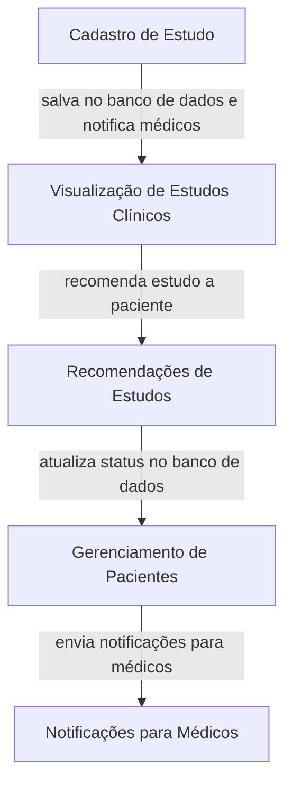
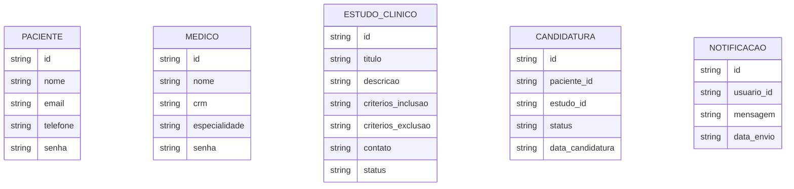

# inovamed-
Plataforma para conectar pacientes, medicos e ensaios clinicos
## Fluxograma

## Diagrama ER

    PACIENTE ||--o{ CANDIDATURA : faz
    CANDIDATURA }o--|| ESTUDO_CLINICO : se_inscreve
    MEDICO ||--o{ ESTUDO_CLINICO : gerencia
    MEDICO ||--o{ NOTIFICACAO : envia
    PACIENTE ||--o{ NOTIFICACAO : recebe
