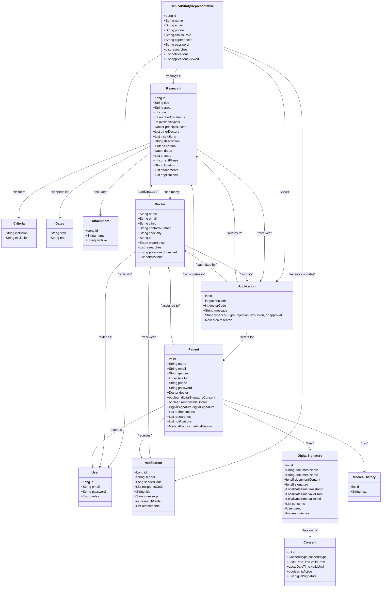

### Diagrama UML

```mermaid
classDiagram
    class User {
        +Long id
        +String email
        +String password
        +Enum roles
    }
    class ClinicalStudyRepresentative {
        +Long id
        +String name
        +String email
        +String phone
        +String clinicalRole
        +String experiences
        +String password
        +List<Research> researches
        +List<Notification> notifications
        +List<Application> applicationsViewed
    }

    class Research {
        +Long id
        +String title
        +String area
        +int code
        +int numberOfPatients
        +int availableSpots
        +Doctor principalDoctor
        +List<Doctor> otherDoctors
        +List<String> institutions
        +String description
        +Criteria criteria
        +Dates dates
        +List<String> phases
        +int currentPhase
        +String location
        +List<Attachment> attachments
        +List<Application> applications
    }

    class Criteria {
        +String inclusion
        +String exclusion
    }

    class Dates {
        +String start
        +String end
    }

    class Notification {
        +Long id
        +String sender
        +Long senderCode
        +List<Long> recipientsCode
        +String title
        +String message
        +int researchCode
        +List<String> attachments
    }

    class Attachment {
        +Long id
        +String name
        +String archive
    }

    class Patient {
        +int id
        +String name
        +String email
        +String gender
        +LocalDate birth
        +String phone
        +String password
        +Doctor doctor
        +boolean digitalSignatureConsent
        +boolean responsibleDoctor
        +DigitalSignature digitalSignature
        +List<String> authorizations
        +List<Research> researches
        +List<Notification> notifications
        +MedicalHistory medicalHistory
    }
    class DigitalSignature {
        +int id
        +String documentName
        +String documentName
        +byte[] documentContent
        +byte[] signature
        +LocalDateTime timestamp
        +LocalDateTime validFrom
        +LocalDateTime validUntil
        +List<Consent> consents
        +User user;
        +boolean isActive;
    }

    class Consent {
        +int id
        +ConsentType consentType
        +LocalDateTime validFrom
        +LocalDateTime validUntil
        +boolean isActive
        +List<DigitalSignature> digitalSignature
    }
    
    

    class MedicalHistory {
        +int id
        +String text
    }

    class Application {
        +int id
        +int patientCode
        +int doctorCode
        +String message
        +String type  %% Type: rejection, expulsion, or approval
        +Research research
    }

    class Doctor {
        +String name
        +String email
        +String clinic
        +String contactNumber
        +String specialty
        +String crm
        +Enum experience
        +List<Research> researches
        +List<Application> applicationsSubmitted
        +List<Notification> notifications
    }

    %% Relations
    ClinicalStudyRepresentative --> User : "extends"
    ClinicalStudyRepresentative --> Research : "manages"
    ClinicalStudyRepresentative --> Notification : "receives updates"
    ClinicalStudyRepresentative --> Application : "views"
    Research --> Criteria : "defines"
    Research --> Dates : "happens in"
    Research --> Doctor : "has many"
    Research --> Attachment : "includes"
    Research --> Application : "receives"
    Doctor --> User : "extends"
    Doctor --> Application : "submits"
    Doctor --> Research : "participates in"
    Doctor --> Notification : "receives"
    Patient --> User : "extends"
    Patient --> Research : "participates in"
    Patient --> Notification : "receives"
    Patient --> MedicalHistory : "has"
    Patient --> DigitalSignature : "has"
    Patient --> Doctor : "assigned to"
    DigitalSignature --> Consent : "has many"
    Application --> Patient : "refers to"
    Application --> Research : "relates to"
    Application --> Doctor : "submitted by"
  
```
