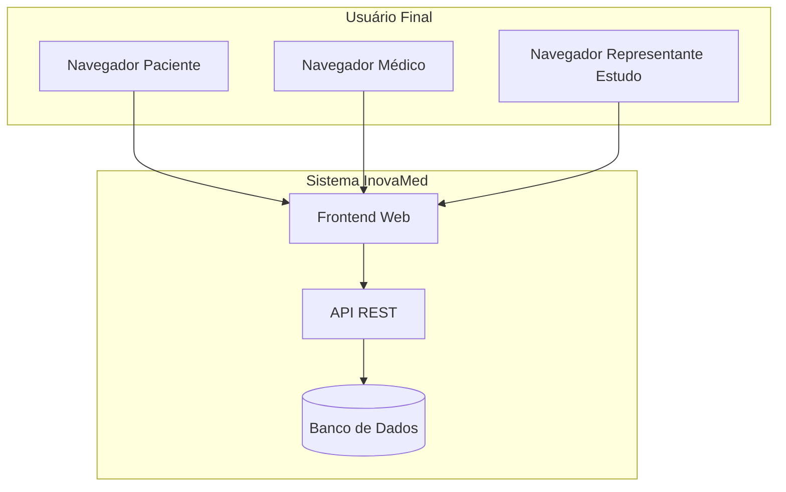

### Diagrama de implantação 

```mermaid
graph TD
  subgraph "Usuário Final"
    paciente[Navegador Paciente]
    medico[Navegador Médico]
    representante[Navegador Representante Estudo]
  end

  subgraph "Sistema InovaMed"
    frontend[Frontend Web]
    backend[API REST]
    db[(Banco de Dados)]
  end

  paciente --> frontend
  medico --> frontend
  representante --> frontend
  
  frontend --> backend
  backend --> db


```
