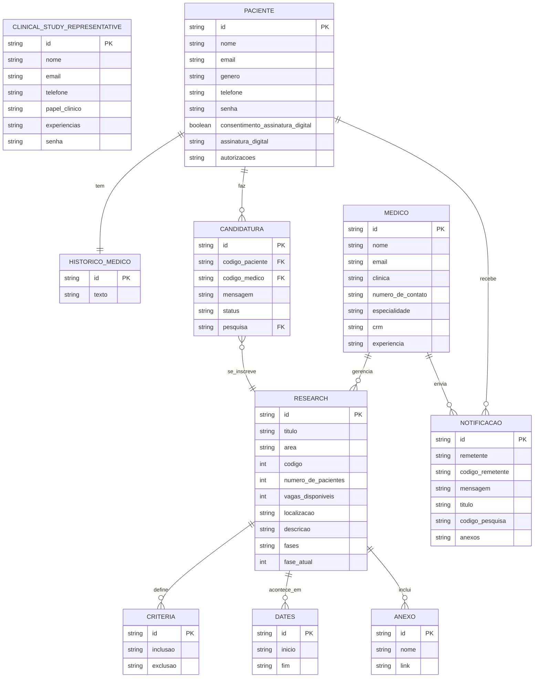

### Diagrama ER

```mermaid
erDiagram
    CLINICAL_STUDY_REPRESENTATIVE {
        string id PK
        string nome
        string email
        string telefone
        string papel_clinico
        string experiencias
        string senha
    }

    RESEARCH {
        string id PK
        string titulo
        string area
        int codigo
        int numero_de_pacientes
        int vagas_disponiveis
        string localizacao
        string descricao
        string fases
        int fase_atual
    }

    CRITERIA {
        string id PK
        string inclusao
        string exclusao
    }

    DATES {
        string id PK
        string inicio
        string fim
    }

    NOTIFICACAO {
        string id PK
        string remetente
        string codigo_remetente
        string mensagem
        string titulo
        string codigo_pesquisa
        string anexos
    }

    ANEXO {
        string id PK
        string nome
        string link
    }

    PACIENTE {
        string id PK
        string nome
        string email
        string genero
        string telefone
        string senha
        boolean consentimento_assinatura_digital
        string assinatura_digital
        string autorizacoes
    }

    HISTORICO_MEDICO {
        string id PK
        string texto
    }

    CANDIDATURA {
        string id PK
        string codigo_paciente FK
        string codigo_medico FK
        string mensagem
        string status
        string pesquisa FK
    }

    MEDICO {
        string id PK
        string nome
        string email
        string clinica
        string numero_de_contato
        string especialidade
        string crm
        string experiencia
    }

    PACIENTE ||--o{ CANDIDATURA : faz
    PACIENTE ||--|| HISTORICO_MEDICO : tem
    CANDIDATURA }o--|| RESEARCH : se_inscreve
    MEDICO ||--o{ RESEARCH : gerencia
    MEDICO ||--o{ NOTIFICACAO : envia
    PACIENTE ||--o{ NOTIFICACAO : recebe
    RESEARCH ||--o{ CRITERIA : define
    RESEARCH ||--o{ DATES : acontece_em
    RESEARCH ||--o{ ANEXO : inclui
```
