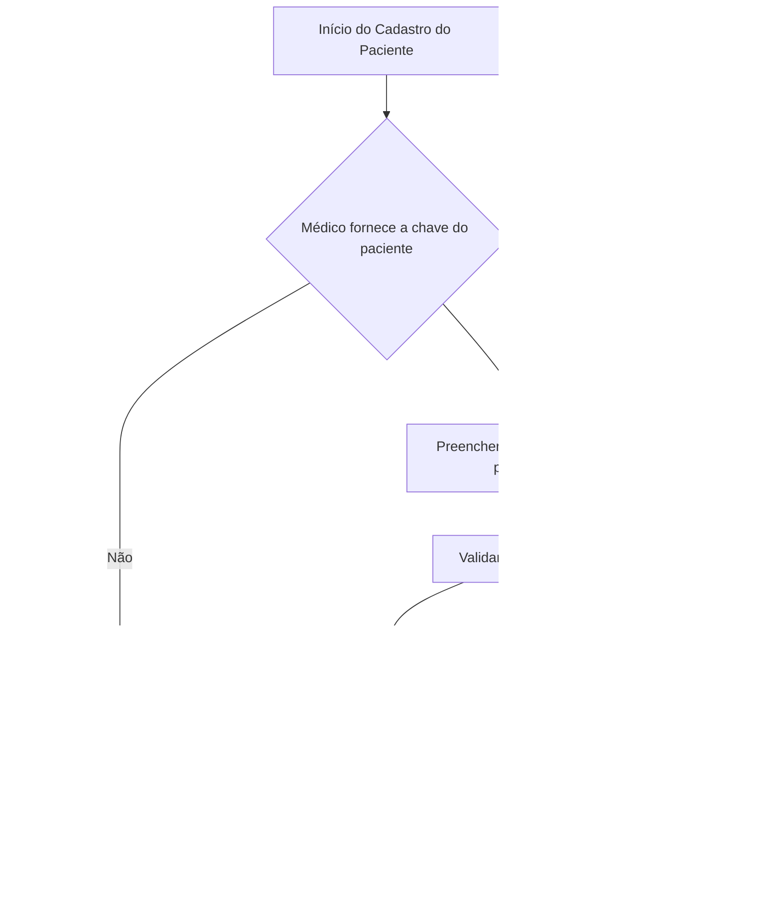
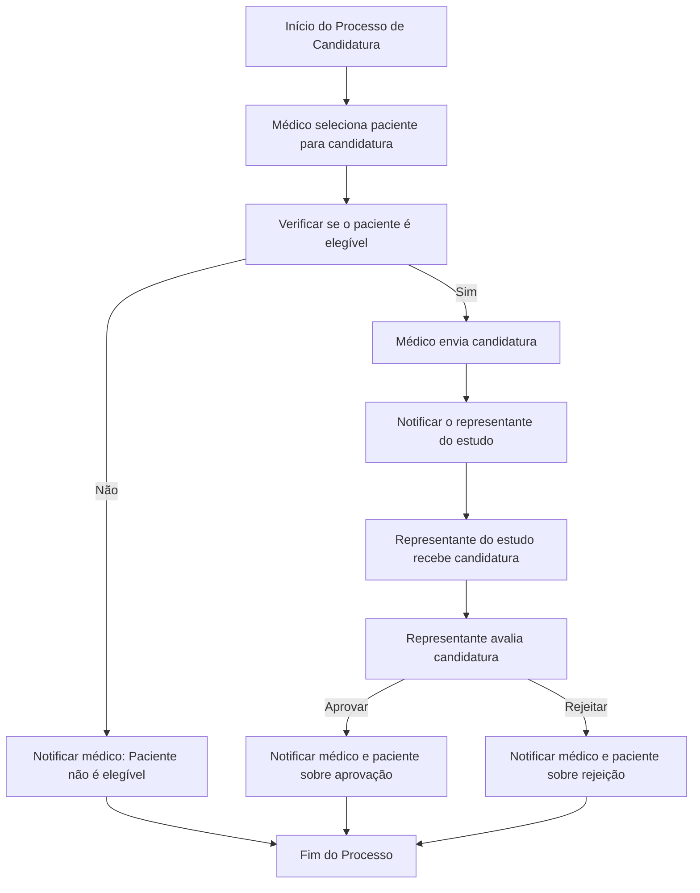
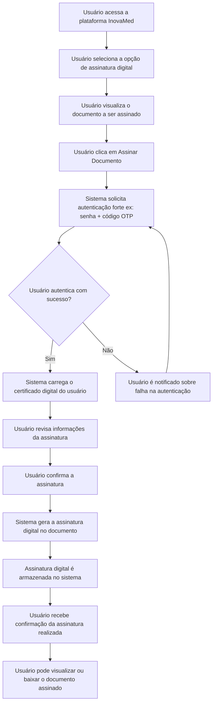

### Fluxograma (cadastro paciente)

```mermaid
flowchart TD
    A[Início do Cadastro do Paciente] --> B{Médico fornece a chave do paciente}
    B -- Sim --> C[Preencher informações do paciente]
    B -- Não --> D[Erro: Chave do médico é necessária]
    D --> E[Fim do Cadastro]
    C --> F[Validar informações]
    F --> |Válidas| G[Cadastrar paciente]
    F --> |Inválidas| H[Erro: Informações inválidas]
    H --> E
    G --> I[Paciente cadastrado com sucesso]
    I --> E[Fim do Cadastro]
```
### Fluxograma (cadidatar paciente)

```mermaid
flowchart TD
    A[Início do Processo de Candidatura] --> B[Médico seleciona paciente para candidatura]
    B --> C[Verificar se o paciente é elegível]
    C --> |Sim| D[Médico envia candidatura]
    D --> E[Notificar o representante do estudo]
    E --> F[Representante do estudo recebe candidatura]
    F --> G[Representante avalia candidatura]
    G --> |Aprovar| H[Notificar médico e paciente sobre aprovação]
    G --> |Rejeitar| I[Notificar médico e paciente sobre rejeição]
    C --> |Não| J[Notificar médico: Paciente não é elegível]
    J --> K[Fim do Processo]
    H --> K
    I --> K
```
### Fluxograma (Concordar com os termos de uso e assinar digitalmente)

```mermaid
flowchart TD
    A[Usuário acessa a plataforma InovaMed] --> B[Usuário seleciona a opção de assinatura digital]
    B --> C[Usuário visualiza o documento a ser assinado]
    C --> D[Usuário clica em Assinar Documento]
    D --> E[Sistema solicita autenticação forte ex: senha + código OTP]
    E --> F{Usuário autentica com sucesso?}
    F -->|Sim| G[Sistema carrega o certificado digital do usuário]
    F -->|Não| H[Usuário é notificado sobre falha na autenticação]
    H --> E
    G --> I[Usuário revisa informações da assinatura]
    I --> J[Usuário confirma a assinatura]
    J --> K[Sistema gera a assinatura digital no documento]
    K --> L[Assinatura digital é armazenada no sistema]
    L --> M[Usuário recebe confirmação da assinatura realizada]
    M --> N[Usuário pode visualizar ou baixar o documento assinado]
```
